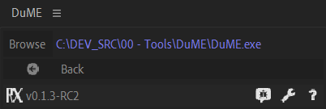

[TOC]

# *After Effects*: Installation

If *Adobe After Effects* is installed on the system, *DuME* is able to render and encode *After Effects* Compositions.

Before these compositions can be rendered, some presets need to be created inside *After Effects*. This operation has to be done only once for each version of *After Effects* you want to use.  

## Using the DuME script

1- Install the DuME Script panel (instructions for [Windows](windows.md) and [Mac](mac.md)) for the version of After Effects you want to use with *DuME*.

2- Launch After Effects.

3- Open the script at least once (it is in the *Windows* menu). Opening it is enough, you don't necessarily need to launch the rendering with the script from inside *After Effects*.

4- If you want to be able to send compositions to DuME from *After Effects*, you first need to go to the  settings panel of the script and set the path to the DuME application.

!!! note
    You can also just run the script just once without actually installing it, via the `File/Scripts/Run script file...` menu entry.

## Manually

If for some reason this script does not work or you cannot use it, follow these steps in the rendere queue:

1- Select the "Lossless" output module. Set its format to `OpenEXR Sequence`, and the channels to RGB+Alpha. Leave all other options to their default values. Save this new module as "DuEXR".

2- Select the "Lossless" output module. Set its format to `WAV`, and the audio options to `96,000Hz / 32 bit / Stereo`. Save this new module as "DuWAV".

3- Select the "Best" render settings. and check the "Skip existing files" box. Save these new settings as "DuMultiMachine".

4- Select the "Best" render settings. Save these settings as "DuBest".
