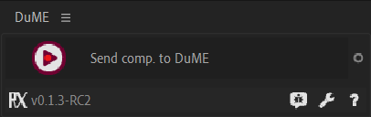
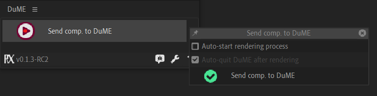

#  *After Effects* Rendering

[TOC]

## From After Effects, using the script

The *Send Comp. to DuME* button will launch DuME and add the active composition to it.

Click on the  options button to adjust a few settings.

All the options you change there will be kept even if you restart *After Effects*. The list of presets is pulled from *DuME* when the script is opened, use the update button at the right if you've made changes to the list of presets in *DuMe* after you have opened the script.

## Add a composition to DuME

Drop or open an *After Effects* project on the input side of *DuME*.

!!! warning
    The framerate is not (yet) detected by *DuME*, don't forget to set it manually.

There are two ways to choose which composition will be rendered: either set the exact composition name, or add the composition to the render queue in *After Effects*, and set the index of the render queue item in *DuME*.

!!! Tip
    A quick way to do this is to make sure the render queue in *After Effects* is empty, then add the composition you want to render. *DuME* automatically renders the first (and only in this case) item in the queue.

!!! Warning
    When rendering an item from the render queue, it has to be enabled in the queue in After Effects, otherwise the After Effects render engine will just ignore it.

You can also use *DuME* to render the whole queue, but in this case *DuME* cannot automatically transcode the result to other formats.

You have the option to use several threads at once when rendering *After Effects* projects, but be careful as this may not work correctly if the number of threads is too high, especially with projects needing a lot of memory.

## Add sound to an After Effects composition

You can add another input to add sound to an After Effects composition. See [*Adding / Changing streams*](mapping.md)