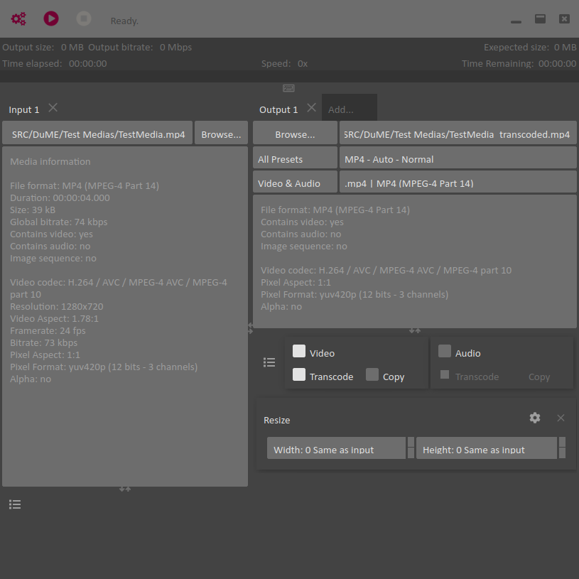

# DuME Introduction

**_DuME_ is a Free and Open Source Media Encoder**.  
It is fast, versatile, and easy-to-use.  
It is mainly based on [*FFmpeg*](https://ffmpeg.org/), a very fast and versatile command-line media encoder.  
*DuME* is also able to render and transcode *Adobe After Effects* projects and to render [*Blender*](http://blender.org) scenes.

[TOC]

## Table of contents

- Installation
    - [Windows](windows.md)
    - [Mac OS X](mac.md)
    - [Linux](linux.md)
- Transcoding
    - [Manage Presets](presets.md)
    - [MP4 / h.264 / h.265](h264-5.md)
    - [Image Sequences](sequences.md)
    - [Adding / Changing streams](mapping.md)
    - [Convert color spaces](color-space.md)
    - [Applying a LUT](lut.md)
    - [Filters](filter.md)
- After Effects rendering
    - [Installation](after-effects-install.md)
    - [Rendering](after-effects-rendering.md)
- Control and automation
    - [Introduction](api.md)
    - [Command line options](cli-options.md)
    - [Server API](server-api.md)

## Description

The goal of DuME is to be as **easy to use** as possible even for beginners, without any compromise on **functionnality for advanced users**.

To achieve this goal, the development of the application follows these guidelines:

- The User Interface has to be both intuitive and nice-looking, as well as fast.
- Transcoding to standard formats (mp4, PNG...) is straightforward, thanks to carefully crafted presets.
- The most common parameters (resolution, frames per second, codec, quality...) can easily be set through the user interface
- Advanced users can add any other parameter available in FFmpeg thanks to the "custom parameters", or even input their own commands through the included command line.
- Common parameters and Custom parameters can be saved as easy-to-use User Presets.

### Available Features

- Transcode any audio or video file, [from any format supported by *FFmpeg*](https://ffmpeg.org/general.html#Supported-File-Formats_002c-Codecs-or-Features) to any other format supported by *FFmpeg*.
- Easy presets for: mp4, wav, PNG, EXR, Quicktime HAP, GIF... - *evolving list*.
- Transcode to and from [Image Sequences](sequences.md) (PNG, EXR...).
- [Mix Media files](mapping.md) (e.g. add sound to an image sequence).
- Easily render *After Effects* projects and transcode to any format supported by *FFmpeg*.
- Render/Transcode queue, *work in progress, possible with command/batch files thanks to [the command line interface](cli-options.md)*.

### Planned Features

- Simple media player (using ffplay).  
    - Preview of the input.
    - Preview of the output.
- Render *Blender* scenes.
- Append several inputs.
- Add subtitles tracks.
- Burn subtitles in picture.
- Burn Metadata in picture (Timecode...).

## About DuME

If you like this free software, please [support the developer on Patreon](http://patreon.com/duduf) to help the continuation of the development of free tools.

## License

### Software

***DuME* Copyright (c) 2017-2020 Nicolas Dufresne and Contributors**  

*DuME* is licensed under the [GNU General Public License v3](gnu-gpl.md).

It also uses *FFmpeg* and *Qt*.

***FFmpeg* Copyright (c) the FFmpeg developers**  
***Qt* Copyright (c) The Qt Company**

This program is free software; you can redistribute them and/or modify them under the terms of the GNU General Public License as published by the Free Software Foundation; either version 3 of the License, or (at your option) any later version.

This program is distributed in the hope that it will be useful, but WITHOUT ANY WARRANTY; without even the implied warranty of MERCHANTABILITY or FITNESS FOR A PARTICULAR PURPOSE.  See the GNU General Public License for more details.

You should have received a copy of the *GNU General Public License* along with *DuME*.  If not, see http://www.gnu.org/licenses/.

  

### Documentation

**Copyright (C)  2019-2020 Nicolas Dufresne and Contributors.**  
Permission is granted to copy, distribute and/or modify this document under the terms of the GNU Free Documentation License, Version 1.3 or any later version published by the Free Software Foundation;  
with no Invariant Sections, no Front-Cover Texts, and no Back-Cover Texts.
A copy of the license is included in the section entitled "[Documentation License](doc-license.md)".

  
