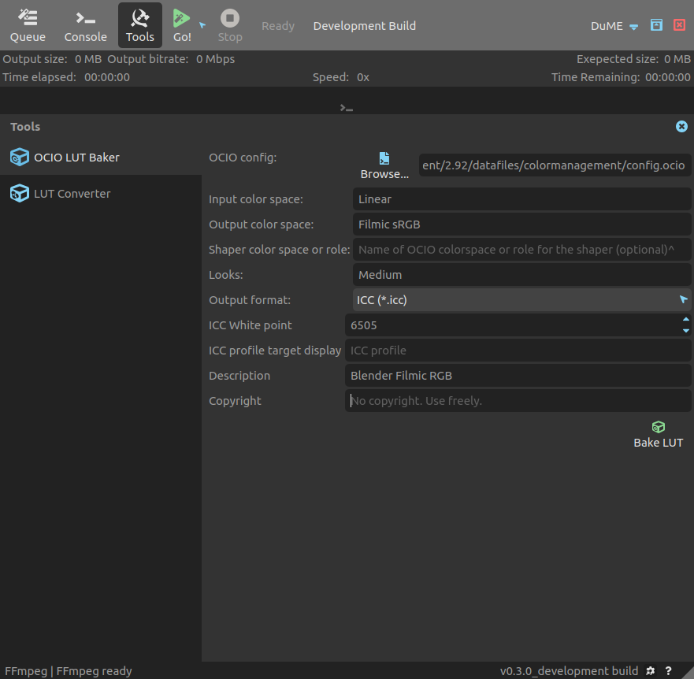

# Bake OCIO LUTs

With *DuME*, you can generate LUTs using any *OpenColorIO* configuration, for example to be able to use *OCIO* color management in applications which do not support *OCIO*.

!!! warning
    To be able to use the baker, you need a working build of the *OCIO* tool `ociobakelut`, a command-line tool included in *OpenColorIO*. You can set its path in the settings of *DuME*.

These LUTs can also be applied to your medias using *DuME* so that *DuME* can be used in your *OCIO* color-managed pipeline.

Read the parameters you need from your `ocio.config` file. In this screenshot you can see how to create an *ICC Profile* from the *Blender* *OCIO* config, converting a *Linear* image to *Filmic sRGB* with the *Medium Contrast* look.

*DuME* can bake LUTs to these formats:

- __Discreet / After Effects / Autodesk (*.3dl)__\*
- __Cinespace (*.csp)__\*
- Discreet legacy 1D-LUT / Houdini (*.lut)
- Iridas (*.itx)
- Truelight (*.cub)
- ICC profile (*.icc)

_\*These formats can then be applied to your medias using_ DuME.
