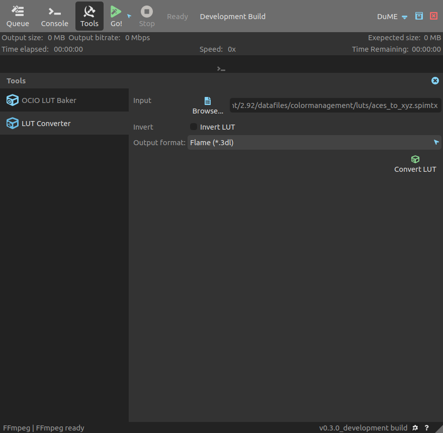

# Convert LUTs

If you have to convert LUTs, *DuME* is able to handle a lot of different formats thanks to *OCIO*.

!!! warning
    To be able to use the baker, you need a working build of the *OCIO* tool `ociobakelut`, a command-line tool included in *OpenColorIO*. You can set its path in the settings of *DuME*.
    
*DuME* can convert LUTs [from all formats supported by OCIO](https://opencolorio.readthedocs.io/en/latest/guides/using_ocio/using_ocio.html#supported-lut-formats), and to these formats:

- __Discreet / After Effects / Autodesk (*.3dl)__\*
- __Cinespace (*.csp)__\*
- Discreet legacy 1D-LUT / Houdini (*.lut)
- Iridas (*.itx)
- Truelight (*.cub)
- ICC profile (*.icc)

_\*These formats can then be applied to your medias using_ DuME.