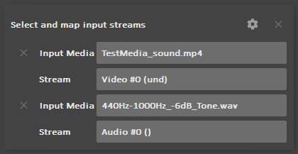

[TOC]

#  Adding / Changing streams

With *DuMe* you can easily add or change audio streams (and other type of streams) in the output files.

## Add a new stream from file

To add new streams to the output file from multiple input medias, you can just **add them as new input medias** (using the "Add..." button on the input panel of *DuME*). You don't need to change anything else.

If the output file can contain only a limited number of streams (e.g. one video and one audio stream, like mp4), and there are more available streams in the input medias, *DuME* will automatically select the best-quality streams it can find from all the input medias. If you want to manually select specific streams, read the section below entitled *Changing / Mapping streams*.

##  Changing / Mapping streams

If you need to select specific streams from the input medias to be used in the output file, you can do so using the ***Select and map input streams* options** on the output panel of *DuME*.

- Add streams using the options button {: style="width:18px"}.
- Then, you can select an input media and the stream to use from it.

!!! important
    As soon as you've added some streams using the mapping options, they will be the **only** streams used in the output file, all other streams will be ignored. That means you have to manually select all the streams you want to use in the output file.

