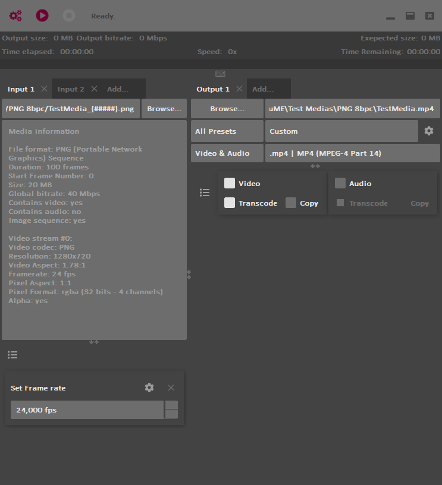

# Transcoding from image sequences

To load image sequences as input medias in *DuME*, **select or drag and drop a single image** from the sequence. It can be any frame, not necessarily the first one. *DuME* automatically detects the complete sequence.

Do not forget to **set the framerate** of the sequence in the input panel.

