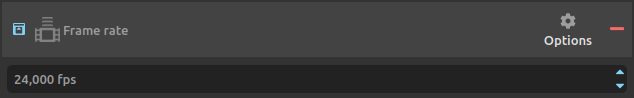
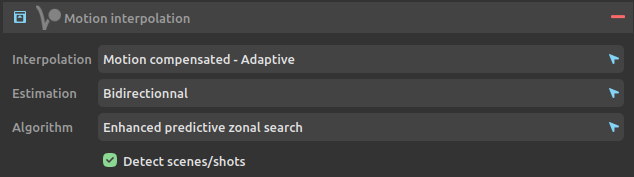

# Adjust speed / Change framerate

*DuME* is able to both adjust the speed of a video, and change its framerate.

These two adjustments can be made with a motion interpolation algorithm to interpolate missing frames.

[TOC]

## Change framerate without changing duration.

Simply changing the framerate without changing the duration of the media is easy: just add the ***framerate*** setting to the output.

Select the desired framerate. The options contains preset for the most common framerates.

By default:

- If the new framerate is **lower** than the input framerate, *DuME* will **drop frames** to match the new rate.
- If the new framerate is **higher** than the input framerate, *DuME* will **duplicate frames** to match the new rate.

Using the ***motion interpolation*** setting, you can change this behaviour and precisely control the interpolation between different framerates, by either **duplicating frames**, **blending them**, or **computing new frames based on the motion**.

The most important parameter is the first one, to select the interpolation mode.

*Estimation* and *Algorithm* can be used to tweak the *Motion Compensated* modes, and adjust the balance between quality and performance.

If the video is made of a single scene/shot, uncheck scene/shot detection. Otherwise, this parameter tells *DuME* to ignore interpolation if a scene change is detected.

## Change framerate without interpolation (changing the duration).

If you'd like to **completely ignore interpolation**, in order to **not change the frame count** when changing the framerate (and thus change the duration), you can combine both the ***framerate*** and the ***speed*** settings.

In this case, the value to use in the speed settings is the result of the simple calculation: `output framerate / input framerate`.

For example, to convert a 24fps video to a 30fps video without interpolation, set the output framerate to *30fps*, and the speed to *1.25x* (30/24).

## Change speed/duration without changing the framerate.

Use the ***speed*** setting to change the duration of a video without changing the framerate.

As with the *framerate* setting, you can combine this with the **motion interpolation** setting to adjust how frames are interpolated.

!!! hint
    Of course you can combine the three settings together to both change the speed and the framerate of the video, using interpolation to keep things as smooth as possible.

